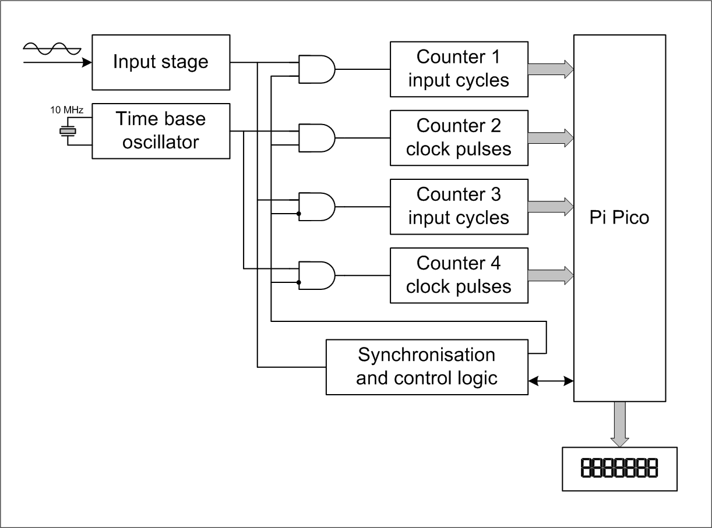

# Pi-Pico_FrequencyCounter
Reciprocal frequency counter with Pi Pico.
Using four of the internal pwm-counter for counting the input pulses and the reference clock alternately without gap.

## Block diagram

## Description
This reciprocal frequency counter has a resolution of 7 digits at one second gate time and 8 digits at 10s gate time.
The time base error of the used TCXO (IQD CFPT-126) is smaller then the resolution so when tested with the 1pps-signal of a gps-receiver the error is ±1 count in the least significant digit.

With the "range"-switch, the gate time can be changed between 0.25s, 1s and 10s.

The calibration process is started by pressing the "cal" button until "Calibration" is shown on the display. A precise 1Hz signal is required at the input for calibration. After calibration, the correction values are stored on the flash memory.
