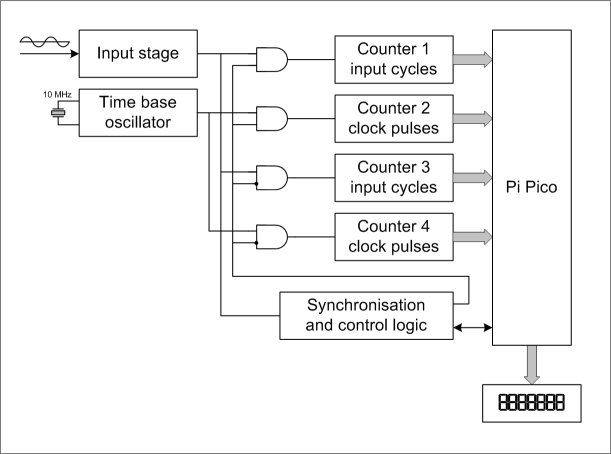

# Pi-Pico_FrequencyCounter
Reciprocal frequency counter with Pi Pico.
Using four of the internal pwm-counter for counting the input pulses and the reference clock alternately without gap.

## Block diagram

